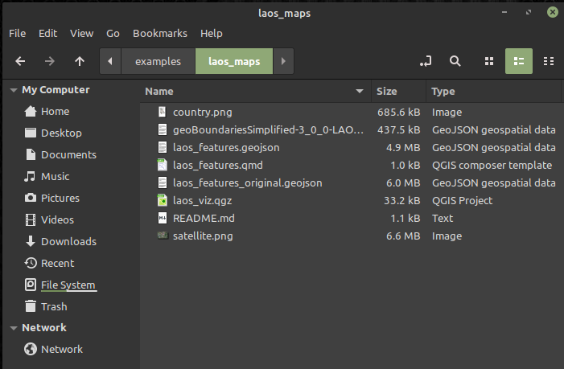
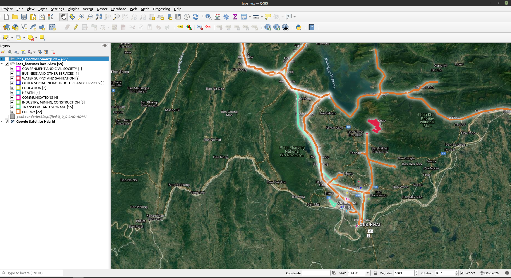
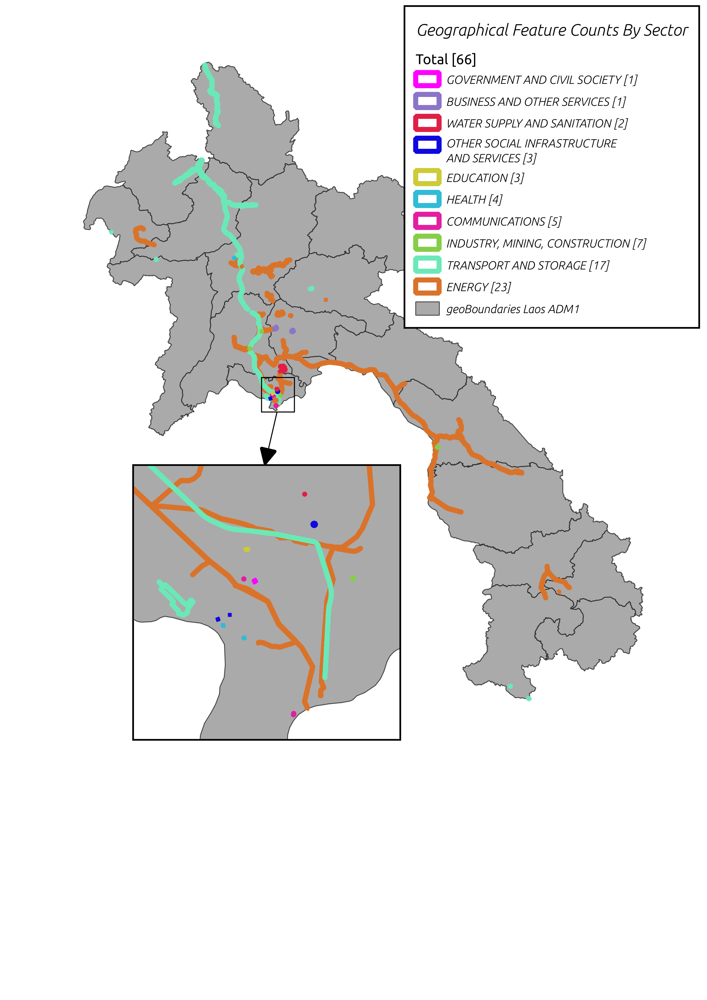

# Visualizing geospatial features using QGIS

This example utilizes the free and open source geographic information system software [QGIS](https://qgis.org/). If you wish to explore the data and visualizations using QGIS, please visit their site to download and install the software. Once installed, you will also need the easy-to-install "QuickMapServices" plugin ([see this tutorial](https://docs.qgis.org/3.16/en/docs/training_manual/qgis_plugins/plugin_examples.html)).

With QGIS and the QuickMapServices plugin installed, download the contents of the `examples/laos_maps` folder from this repository. You can simply download a zipfile of the entire repository using [this link](https://github.com/aiddata/china-osm-geodata/archive/refs/heads/master.zip) as well (please note that the full repository is fairly large, approximately 270MB when zipped). Once downloaded, navigate to and open the `laos_viz.qgz` file. This file should automatically load in QGIS.

Example folder: \

Project opened with QGIS: \

You can explore the geospatial features within QGIS, or navigate to the `Project > Layouts` menu to open one of two pre-built visualizations. The "country" visualization looks at projects across the country of Laos, while the "satellite" visualization zooms in to see the detail of individual features within the capital.

Country visualization: \

Vientiane visualization:\

