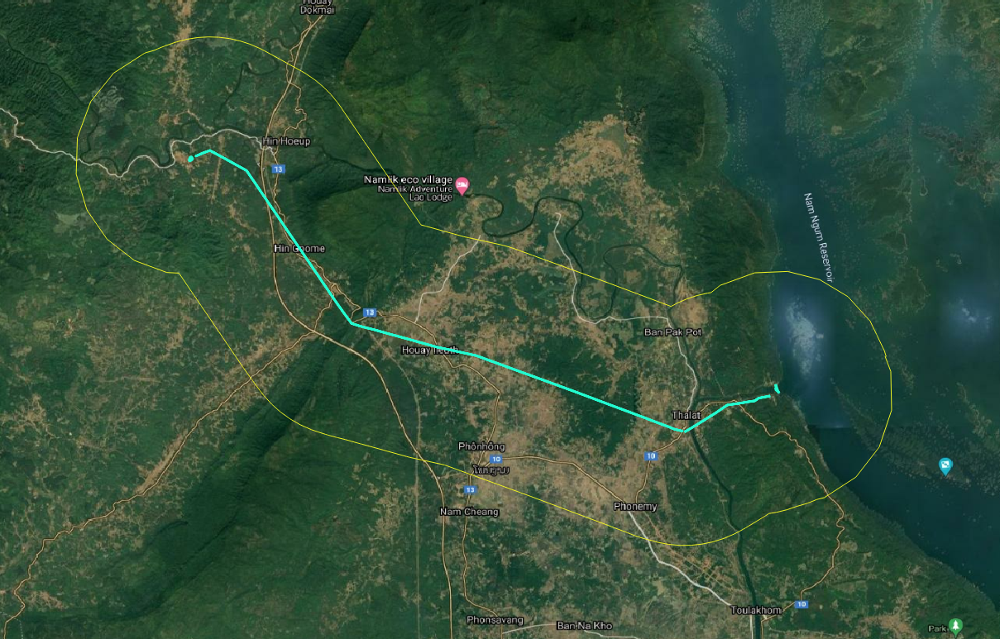
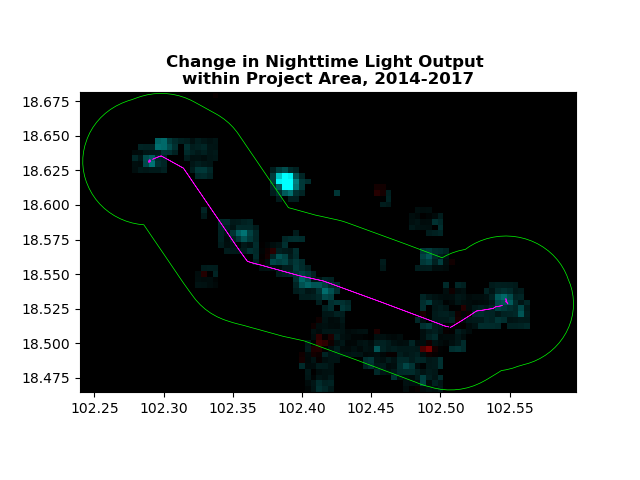
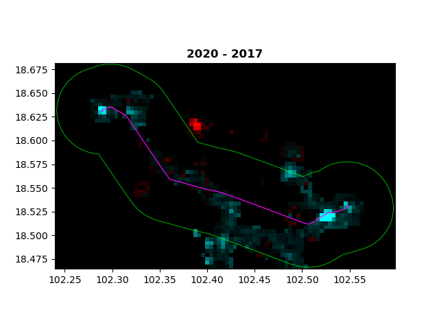

# Analyzing Nighttime Lights Trends Around Project Sites

In this example we will look at how you can use nighttime lights (NTL) imagery, and geospatial data from AidData's Global Chinese Development Finance Dataset to examine changes in nighttime light levels before and after project implementation.

Note: Code for this example is contained within the [ntl_demo.py](ntl_demo.py) file. Accompanying data is available within the same folder as this readme.

Project features in Laos consisting of a power plant and substation connected by transmission (in teal). A 5km buffer (in yellow) around the project was created within which to examine NTL trends.

Based on an approximate project implementation date of 2017, we calculate changes in NTL over the 3 years prior to implementation and the 3 years after implementation for each 500 meter pixel for which NTL data is available. Red pixels indicate a decrease in NTL, while blue pixel indicate an increase in NTL.

As reflected in the above visualization, there is a 26% increase in the rate of change in NTL levels within the 5km buffer around the project features in the period after the projects were implemented compared to the period before implementation.
